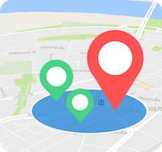

#LAY! 

'Location Around You' is an android application which allows you to look for locations that are used by Instagram. Futhermore you can search for a special Location where you want to find more location of Instagram.

   

        
You can enter a special location and edit die range of locations and distance.  
   
    
  

Popular locations of Instagram were shown around Cologne.    
     

       
An example is the "Photokina", the largest exhibition for photography.  
   
##Installation

The app is an apk-file named: "aroundU.apk".
For using the app you need an android emulator or an android smartphone. The android version should be 5.1 Lollipop or higher with the google api 22+.

###Installation on a smartphone

1. Activate Unkown sources at your phone settings.

2. download apk-file and open and install it.

3. GPS and Internet should be activated to run the app correctly

###Installation on an emulator

For windows and Mac OS you can use [Andy](http://www.andyroid.net), because you can install apk-files and it runs on a virtual box.
In the most cases the installation is the same as on the smartphone. It should be used the correct android version as well.

##Development

###Developed with:

The IDE [Android Studio](https://developer.android.com/studio/index.html) 2.1+ was the main tool to develope the app. Android Studio is based on IntelliJ by
 [JetBrains](https://www.jetbrains.com)  and is the official IDE of Google for android apps. For editing and creating the pictures i used [Autodesk SketchBook](https://itunes.apple.com/de/app/autodesk-sketchbook/id863486266?mt=12). 

###Developed from:

Paul Degemann

##Version

1.0
