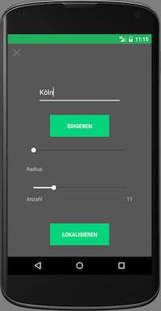

#Weltkarte von Instagram-Locations (Android App)

'Location Around You' ist eine Android Application, die es ermöglicht bei Instagram genutzte und eigentragene Locations in der direkten Umgebung, aber auch an konkret gesuchten Orten anzuzeigen.

Man kann ein Ort eingeben, Anzahl der Orte wählen und auch den Radius einstellen.

Angezeigt wird Köln mit den umgebenden Orten.

Aktuell (21.09.2016) läuft hier bspw. die größte Photographie-Messe der Welt, die Photokina.
##Installieren der App

Die App liegt als apk-Datei vor: "aroundU.apk".
Um die App nutzen zu können benötigt es entweder einen Android Emulator für den Computer oder ein Android Smartphone. Dabei sollte die Android Version 5.1 Lollipop oder höher mit Google Api 22+ verwendet werden, da sonst einige Eigenschaften der App nicht funktionieren werden.

###Installieren auf dem Smartphone

1. Unter den Einstellungen des Smartphones das Installieren von Unbekannten Quellen aktivieren.

2. apk-Datei herunterladen, anschließend öffnen und installieren.

3. GPS und Internet aktivieren und die installierte App öffnen.

###Installieren auf einem Emulator

Für Windows und Mac OS bietet sich bspw. der Emulator [Andy](http://www.andyroid.net) an, da dort APKs installiert werden können und ganz allgemein über eine Virtual Box läuft. Es sollte aber auch auf jedem beliebigen anderen Emulator funktionieren, die apks unterstüzt. Hier muss die Installation emulatorspezifisch geschehen. In den meisten Fällen sieht es so aus wie beim Smartphone selbst.
Natürlich muss auch hier die korrekte Android Version genutzt werden (Android Version 5.1 Lollipop oder höher sein mit Google Api 22+).

##Entwicklung

###Entwickelt mit:

Hauptsächlich wurde als IDE [Android Studio](https://developer.android.com/studio/index.html) 2.1+ benutzt. Android Studio basiert auf Intellij von [JetBrains](https://www.jetbrains.com) und ist die von Google offizielle Entwicklungsumgebung für Android Apps.
Um die Bilder, wie Marker etc. zu erstellen, habe ich [Autodesk SketchBook](https://itunes.apple.com/de/app/autodesk-sketchbook/id863486266?mt=12) verwendet.

###Entwickelt von:

Paul Degemann

##Version

1.0